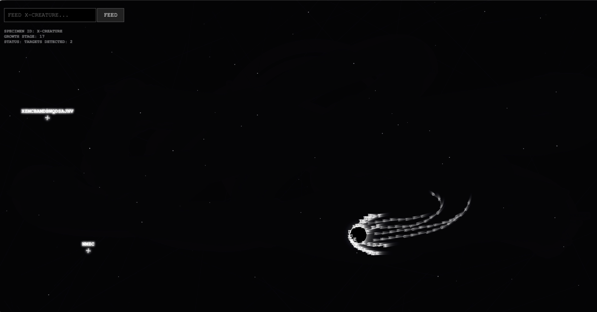

# PROJECT TITLE
## Short Description
*An interactive system where a digital creature grows and changes through user-input text, visualising identity as a process of continuous accumulation.*
## Concept / Intent
*The project explores how, within systems shaped by platforms and algorithms, individuals gradually take form through continuous input and feedback. In this context, identity is not seen as something fixed or inherent, but as something that is continuously shaped by external information.*
## Technology Used
*p5js*
## How to Run / Install
*Input text to feed the creature.*
*Each time it eats a food “text”, the creature grows a new tentacle made from that text. As more inputs are given, the tentacles accumulate, and the creature’s body becomes increasingly complex.*
## Requirements
*p5js or vscode*
## Screenshots / Media
**
## Credits / Acknowledgements
*Me*
## License

## Contact / Links
